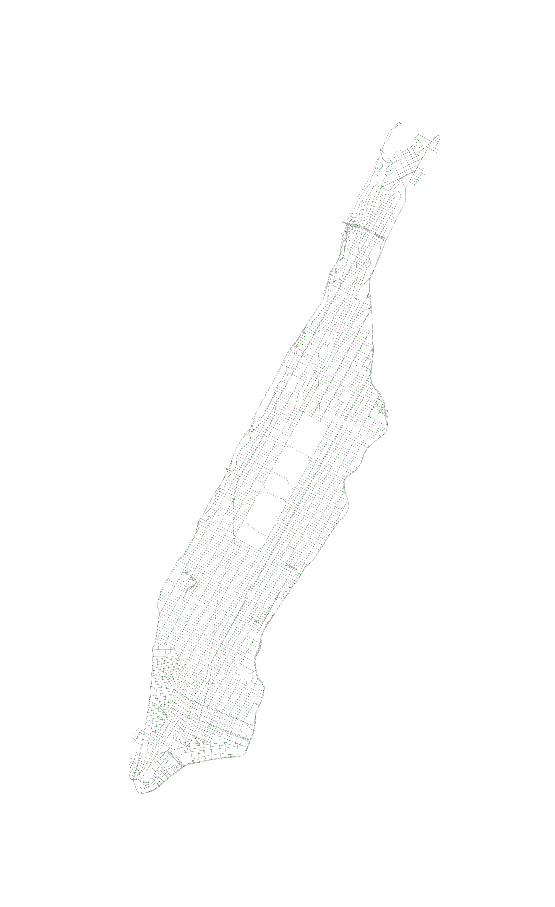

# 获取地图
使用osmnx的`graph_from_place`获取某个城市的地图：
```py
G = ox.graph_from_place('Manhattan Island, New York City, New York, USA', network_type='drive')
fig, ax = ox.plot_graph(G, node_size=1, node_color='g', save=False, edge_linewidth=0.3, fig_height=20,
                        bgcolor='k', show=False)
fig.savefig('Manhattan.png', dpi=300)
```
